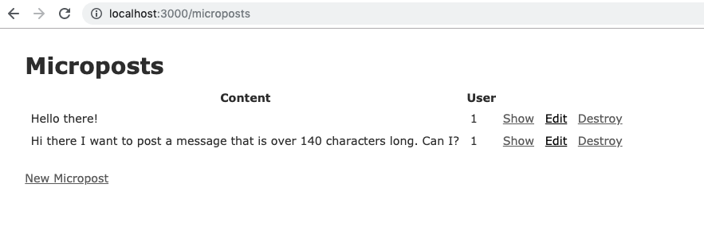
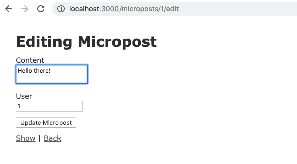
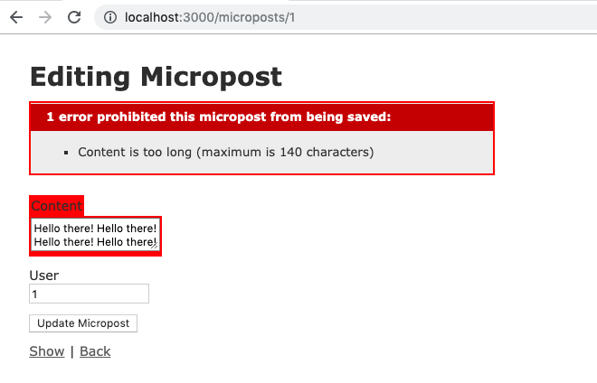
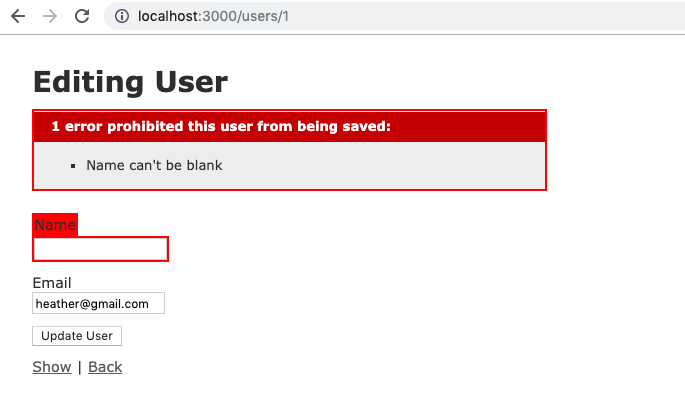
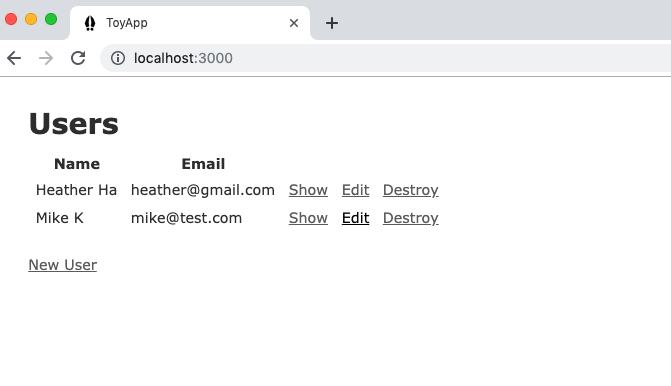

# Toy App - Ruby on Rails Practice
- I created this project to practice Ruby on Rails based on [Toy App](https://www.railstutorial.org/book/toy_app) on the Rails Tutorial page. The app allows users to write, edit, and delete microposts. 

### Set-Up:
* Clone this repo `https://github.com/hlhartley/jquery-practice.git`
* `cd` into the toy_app file
* Run the command `bundle install`
* Run the command `rails server`
* View in browser at localhost:3000/

### Primary Technologies Used:
* Ruby on Rails

### Routes:
- GET	/users

- GET	/users/1	
- GET	/users/new
- POST	/users
- GET	/users/1/edit
- PATCH	/users/1
- DELETE /users/1

